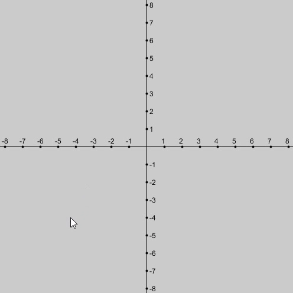
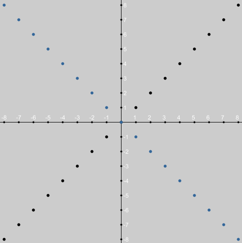
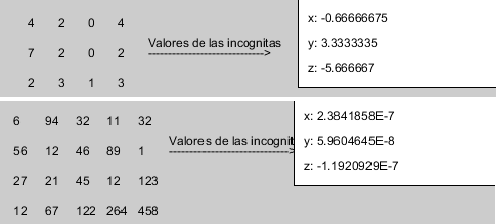
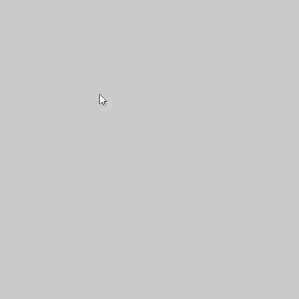

# Processing Math Sketches

Four visual mathematics exercises written in **Processing Java mode**. The original README reports testing with Processing `3.5.4`; compatibility with other versions has not been verified here.

## Open a sketch

Open the `.pde` file inside its matching directory in the Processing editor, then select **Run**. Each directory is a separate sketch; do not combine all files into one project. No npm or Python installation is needed.

| Sketch | What to do |
| --- | --- |
| [Line through two points](Ecuacion_de_la_recta_con_coordenadas/Ecuacion_de_la_recta_con_coordenadas.pde) | Click two positions to define a line; pressing a key resets the drawing state. |
| [Graph two line equations](Graficar_ecuacion/Graficar_ecuacion.pde) | Edit slope/intercept variables in the source and run the sketch. |
| [Gauss–Jordan matrix exercise](Matriz_GaussJordan/Matriz_GaussJordan.pde) | Edit the augmented matrix in the source to explore elimination. |
| [Triangle area](area_de_un_triangulo/area_de_un_triangulo.pde) | Click three points to construct a triangle and calculate its area. |

## Line through two points

The two clicks are coordinates, not the slope and intercept themselves. The sketch derives those quantities from the selected points.

| Example | Processing result | GeoGebra comparison |
| --- | --- | --- |
| First line | [View](Ecuacion_de_la_recta_con_coordenadas/result-1.png) | [View](Ecuacion_de_la_recta_con_coordenadas/result-1-geogebra.png) |
| Second line | [View](Ecuacion_de_la_recta_con_coordenadas/result-2.png) | [View](Ecuacion_de_la_recta_con_coordenadas/result-2-geogebra.png) |

## Two line equations

`m`, `b`, `m1`, and `b1` configure the two lines in `Graficar_ecuacion.pde`.

[Original GeoGebra comparison](Graficar_ecuacion/result-geogebra.png)

## Gauss–Jordan elimination

The source uses a three-row augmented matrix. Adapt its values before running and inspect the displayed elimination output.

## Triangle area

## Validation and limitations

All previews above are repository-hosted historical images. The sketches are learning exercises rather than a general numerical library. Check vertical lines, repeated points, degenerate triangles, and zero pivots before extending their formulas. There is no automated test suite, and no Processing runtime execution was performed during this documentation update.
